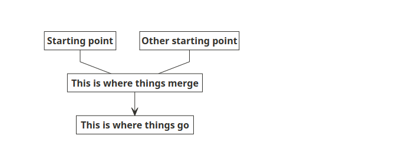
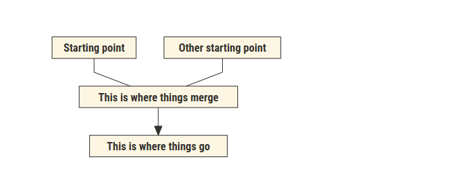
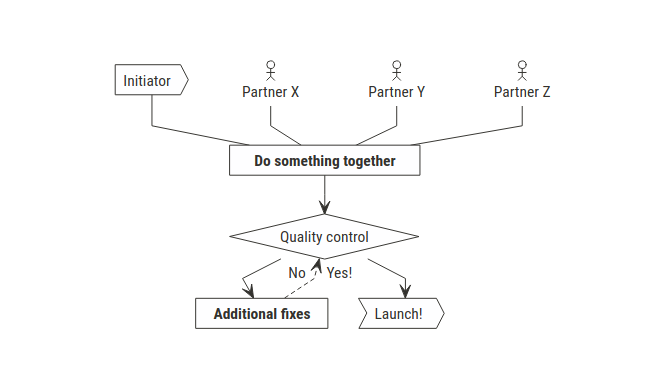

<!-- README.md is generated from README.Rmd. Please edit that file -->

# nomnomlgraph

<!-- badges: start -->

[](https://lifecycle.r-lib.org/articles/stages.html#experimental)
<!-- badges: end -->

The goal of `nomnomlgraph` is to enable the creation of basic diagrams
such as those created with [nomnoml](https://nomnoml.com/) without
having to familiarise with its syntax.

To create a `nomnoml` diagram with `nomnomlgraph` you will need two data
frames: one with *nodes*, the other with *edges*, in line with the
structure of data tyipically used to generate network graphs.

This facilitate cooperation across teams with members that may be
intimidated by `nomnoml` syntax and will feel at home in front of a
spreadsheet, or even as a shared spreasheet on Google Drive.

## Installation

You can install the development version of nomnomlgraph like so:

``` r
# install.packages("remotes")
remotes::install_github("giocomai/nomnomlgraph")
```

## How to use

First, you will need a data frame with nodes:

``` r
library("nomnomlgraph")
nodes <- tibble::tribble(~id, ~text, 
                         1, "Starting point",
                         2, "Other starting point",
                         3, "This is where things merge",
                         4, "This is where things go")
knitr::kable(nodes)
```

|  id | text                       |
|----:|:---------------------------|
|   1 | Starting point             |
|   2 | Other starting point       |
|   3 | This is where things merge |
|   4 | This is where things go    |

Then one with edges:

``` r
edges <- tibble::tribble(~from, ~to, ~association,
                         1, 3, "-", 
                         2, 3, "-",
                         3, 4, "->")

knitr::kable(edges)
```

| from |  to | association |
|-----:|----:|:------------|
|    1 |   3 | \-          |
|    2 |   3 | \-          |
|    3 |   4 | -\>         |

Et voilà:

``` r

nn_graph(nodes = nodes, 
         edges = edges)
```

<!-- -->

To which you can add a bunch of customisations, see `?nn_graph()` for
details. E.g.

``` r
nn_graph(nodes = nodes, 
         edges = edges,
         fill = "#fdf6e3",
         edgesStyle = "rounded", 
         font = "Roboto Condensed",
         fillArrows = "true",
         svg = TRUE)
```

<!-- -->

## Something a bit more complex?

``` r
library("nomnomlgraph")
nodes <- tibble::tribble(~id, ~text, ~classifier,
                         1, "Partner X", "actor",
                         2, "Partner Y", "actor",
                         3, "Partner Z", "actor",
                         4, "Initiator", "sender",
                         5, "Do something together", "",
                         6, "Quality control", "choice", 
                         7, "Additional fixes", "", 
                         8, "Launch!", "transceiver")
knitr::kable(nodes)
```

|  id | text                  | classifier  |
|----:|:----------------------|:------------|
|   1 | Partner X             | actor       |
|   2 | Partner Y             | actor       |
|   3 | Partner Z             | actor       |
|   4 | Initiator             | sender      |
|   5 | Do something together |             |
|   6 | Quality control       | choice      |
|   7 | Additional fixes      |             |
|   8 | Launch!               | transceiver |

Then one with edges:

``` r
edges <- tibble::tribble(~from, ~to, ~association,
                         4, 5, "-",
                         1, 5, "-", 
                         2, 5, "-",
                         3, 5, "-",
                         5, 6, "->",
                         6, 7, "No ->",
                         7, 6, "-->", 
                         6, 8, "Yes! ->")

knitr::kable(edges)
```

| from |  to | association |
|-----:|----:|:------------|
|    4 |   5 | \-          |
|    1 |   5 | \-          |
|    2 |   5 | \-          |
|    3 |   5 | \-          |
|    5 |   6 | -\>         |
|    6 |   7 | No -\>      |
|    7 |   6 | –\>         |
|    6 |   8 | Yes! -\>    |

``` r
nn_graph(nodes = nodes, 
         edges = edges,
         edgesStyle = "rounded", 
         font = "Roboto Condensed",
         svg = TRUE,
         width = 600,
         height = 300,
         )
```

<!-- -->

## Finalise on nomnoml.com

If you enable set the “output” parameter to “code”, you will get a chunk
of text that you can paste directly [on
nomnoml.com](https://nomnoml.com/#view/%23direction%3A%20down%0A%23edges%3A%20rounded%0A%23lineWidth%3A%201%0A%23fill%3A%20%23FEFEFF%0A%23zoom%3A%204%0A%23arrowSize%3A%201%0A%23bendSize%3A%200.3%0A%23gutter%3A%205%0A%23edgeMargin%3A%200%0A%23fillArrows%3A%20false%0A%23font%3A%20sans%0A%23fontSize%3A%2012%0A%23leading%3A%201.25%0A%23padding%3A%208%0A%23spacing%3A%2040%0A%23stroke%3A%20%2333322E%0A%23title%3A%20filename%0A%0A%5B%3Csender%3EInitiator%5D-%5BDo%20something%20together%5D%0A%5B%3Cactor%3EPartner%20X%5D-%5BDo%20something%20together%5D%0A%5B%3Cactor%3EPartner%20Y%5D-%5BDo%20something%20together%5D%0A%5B%3Cactor%3EPartner%20Z%5D-%5BDo%20something%20together%5D%0A%5BDo%20something%20together%5D-%3E%5B%3Cchoice%3EQuality%20control%5D%0A%5B%3Cchoice%3EQuality%20control%5DNo%20-%3E%5BAdditional%20fixes%5D%0A%5BAdditional%20fixes%5D--%3E%5B%3Cchoice%3EQuality%20control%5D%0A%5B%3Cchoice%3EQuality%20control%5DYes!%20-%3E%5B%3Ctransceiver%3ELaunch!%5D)
for further adjustments.

``` r
nn_graph(nodes = nodes, 
         edges = edges,
         output = "code",
         edgesStyle = "rounded"
         ) %>% 
  cat()
#direction: down
#edges: rounded
#lineWidth: 1
#fill: #FEFEFF
#zoom: 4
#arrowSize: 1
#bendSize: 0.3
#gutter: 5
#edgeMargin: 0
#fillArrows: false
#font: sans
#fontSize: 12
#leading: 1.25
#padding: 8
#spacing: 40
#stroke: #33322E
#title: filename

[<sender>Initiator]-[Do something together]
[<actor>Partner X]-[Do something together]
[<actor>Partner Y]-[Do something together]
[<actor>Partner Z]-[Do something together]
[Do something together]->[<choice>Quality control]
[<choice>Quality control]No ->[Additional fixes]
[Additional fixes]-->[<choice>Quality control]
[<choice>Quality control]Yes! ->[<transceiver>Launch!]
```

(remember to use `cat()` if you are copy/pasting it from the console to
process the new lines)

## More

For more details, see the documentation of the `nomnoml` package for R:
<https://github.com/rstudio/nomnoml/>

The original nomnoml: <https://nomnoml.com/>

## Licensing

This package is distributed under the MIT license.
